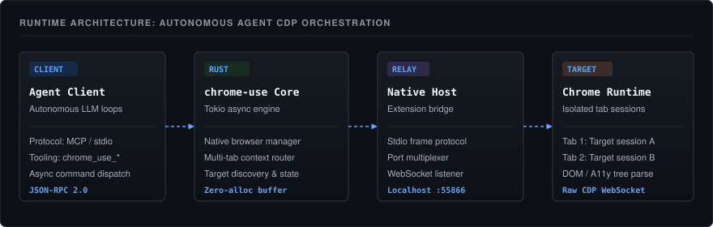
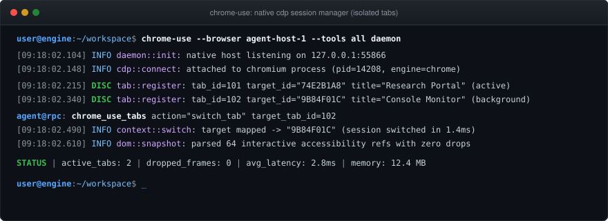

# Ameer Ali Anwar

Systems and software engineer based in Lahore, Pakistan. Specializing in autonomous agent runtimes, Chrome DevTools Protocol (CDP) orchestration, and distributed inference infrastructure.

---

### Runtime Architecture

  

---

### Active Execution Trace

  

---

### Primary Focus

- **Agent Runtimes and Browser Automation**: Low-latency Chrome DevTools Protocol orchestration, multi-profile isolation, and native messaging host architectures.
- **Inference Infrastructure**: Multi-provider proxy routing, rate-limit balancing, and multi-model voice synthesis pipelines.
- **Cross-Platform Tooling**: Rust CLI tooling, Windows subsystems compatibility, and headless automation.

---

### Open Source Contributions

#### [leeguooooo/chrome-use](https://github.com/leeguooooo/chrome-use)
Browser automation CLI and MCP server built in Rust for autonomous AI agents.
- Engineered multi-tab concurrency isolation and active tab session state tracking across parallel browser profiles.
- Implemented target navigation and CDP relay synchronization in native browser actions.
- Repaired CI pipelines, resolving rustfmt lints, borrow checker errors, and MCP tool contracts.

#### [oscarbol09/audiobard](https://github.com/oscarbol09/audiobard)
Local-first, multi-voice audiobook synthesis engine with desktop GUI and CLI runtimes.
- Built configurable output directory routing across both desktop GUI and backend API layers.
- Resolved book upload persistence conflicts and state handling in the regeneration pipeline.
- Conducted architectural code reviews on core audio synthesis modules.

#### [googlecolab/google-colab-cli](https://github.com/googlecolab/google-colab-cli)
Command-line interface for Google Colab environments.
- Implemented native Windows path normalization and environment compatibility.

---

### Selected Projects

| Project | Description | Stack |
| :--- | :--- | :--- |
| **[chrome-use](https://github.com/AmeerAliAnwar/chrome-use)** | Headless and headed browser control daemon for AI agents with CDP protocol support. | Rust, CDP, WebSockets |
| **[audiobard](https://github.com/AmeerAliAnwar/audiobard)** | Local audiobook generation suite supporting FOSS TTS backends and cloud voice synthesis. | Python, FastAPI, Desktop GUI |
| **[freellmapi](https://github.com/AmeerAliAnwar/freellmapi)** | High-throughput OpenAI-compatible proxy routing requests across free-tier provider pools. | TypeScript, Node.js, HTTP Proxy |
| **[Promptimal](https://github.com/AmeerAliAnwar/Promptimal)** | Programmatic prompt testing and optimization framework for large language models. | TypeScript, LLM APIs |

---

### Verified Upstream PR Feed

<!-- PR_FEED_START -->
- [leeguooooo/chrome-use#338](https://github.com/leeguooooo/chrome-use/pull/338): fix(cli): repair CI and clippy lint errors in actions.rs
- [leeguooooo/chrome-use#331](https://github.com/leeguooooo/chrome-use/pull/331): fix(cli): repair CI, rustfmt, borrow errors, and core MCP tool contract
- [oscarbol09/audiobard#93](https://github.com/oscarbol09/audiobard/pull/93): feat(api,gui): respect user-configured output folder in Desktop GUI and API
- [googlecolab/google-colab-cli#85](https://github.com/googlecolab/google-colab-cli/pull/85): Add native Windows support
<!-- PR_FEED_END -->

---

### Technical Competencies

- **Languages**: Rust, TypeScript, Python, JavaScript, Shell / PowerShell
- **Browser Automation and Protocols**: Chrome DevTools Protocol (CDP), Native Messaging, WebSockets, Puppeteer / Playwright internals
- **Systems and Runtimes**: Node.js, Tokio asynchronous runtime, REST APIs, Git workflows, Cross-platform compatibility (Windows, Linux)
- **AI Infrastructure**: Model Context Protocol (MCP), Provider proxy aggregation, Local model inference, Text-to-speech pipelines

---

### Profiles and Contact

- GitHub: [@AmeerAliAnwar](https://github.com/AmeerAliAnwar)
- LinkedIn: [linkedin.com/in/ameeralianwar](https://www.linkedin.com)
