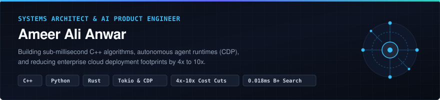
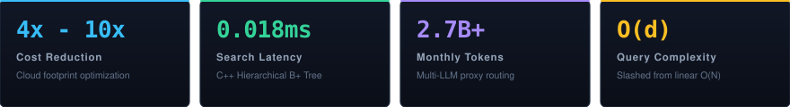
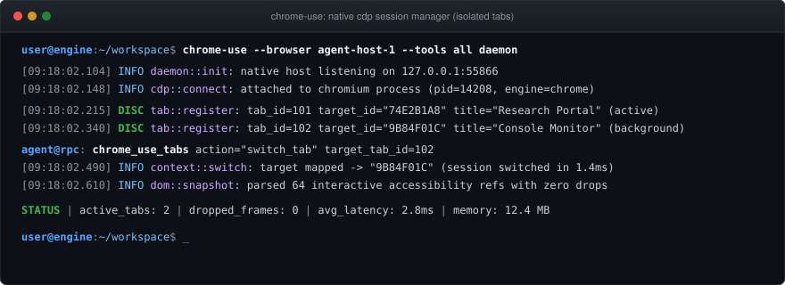

  

  
  
  
  

  

---

### Core Engineering Focus

* **Backend Performance and Cost Optimization**: Slashing cloud infrastructure footprints by 4x to 10x through database query optimization, memory tuning, and containerization.
* **Low-Latency Algorithmic Systems**: Engineering sub-millisecond data structures in C++ and Python, including custom Hierarchical B+ Tree search indexes (0.018ms lookup latency).
* **Autonomous Agent Runtimes and Browser Automation**: Low-latency Chrome DevTools Protocol (CDP) orchestration, multi-profile tab isolation, and native messaging host architectures in Rust and TypeScript.
* **Inference and Media Infrastructure**: Multi-provider LLM proxy routing, deterministic fallback pipelines, and automated zero-gap voice synthesis with FFmpeg and PyTorch.

---

### Runtime Architecture

  

---

### Active Execution Trace

  

---

### Open Source Contributions

#### [leeguooooo/chrome-use](https://github.com/leeguooooo/chrome-use)
Browser automation CLI and Model Context Protocol (MCP) server built in Rust for autonomous AI agents.
* Engineered multi-tab concurrency isolation and active tab session state tracking across parallel browser profiles.
* Implemented target navigation and CDP relay synchronization in native browser actions.
* Repaired CI pipelines, resolving rustfmt lints, borrow checker errors, and core MCP tool contracts.

#### [oscarbol09/audiobard](https://github.com/oscarbol09/audiobard)
Local-first, multi-voice audiobook synthesis engine with desktop GUI and CLI runtimes.
* Built configurable output directory routing across both desktop GUI and backend API layers.
* Resolved book upload persistence conflicts and state handling in the audio regeneration pipeline.
* Conducted architectural code reviews on core audio synthesis modules.

#### [googlecolab/google-colab-cli](https://github.com/googlecolab/google-colab-cli)
Command-line interface for Google Colab environments.
* Implemented native Windows path normalization and environment compatibility.

---

### Selected Systems and Implementations

* **[FinVerz Core Banking Engine](https://ameerali.dpdns.org/)** (`C++`, `Hierarchical B+ Tree`, `Encrypted Ledger`)
  High-performance financial system featuring a custom Hierarchical Indexed Search Algorithm achieving 0.018ms query latencies and O(d) search complexity.

* **[Backend Cost and Latency Optimization](https://ameerali.dpdns.org/)** (`Python`, `Docker`, `PostgreSQL`)
  Production infrastructure optimization framework cutting cloud deployment costs by 4x to 10x through query refactoring, memory footprint reduction, and container tuning.

* **[chrome-use](https://github.com/AmeerAliAnwar/chrome-use)** (`Rust`, `CDP`, `WebSockets`)
  Headless and headed browser control daemon for AI agents with full Chrome DevTools Protocol support.

* **[audiobard](https://github.com/AmeerAliAnwar/audiobard)** (`Python`, `FastAPI`, `Desktop GUI`)
  Local audiobook generation suite supporting FOSS TTS backends and cloud voice synthesis.

* **[freellmapi](https://github.com/AmeerAliAnwar/freellmapi)** (`TypeScript`, `Node.js`, `HTTP Proxy`)
  High-throughput OpenAI-compatible proxy routing requests across free-tier provider pools.

* **[Promptimal](https://github.com/AmeerAliAnwar/Promptimal)** (`TypeScript`, `LLM APIs`)
  Programmatic prompt testing and optimization framework for large language models.

---

### Verified Upstream PR Feed

<!-- PR_FEED_START -->
- [leeguooooo/chrome-use#342](https://github.com/leeguooooo/chrome-use/pull/342): perf(ext): eliminate CDP event flooding, reduce artificial sleeps, and add batch execution
- [leeguooooo/chrome-use#338](https://github.com/leeguooooo/chrome-use/pull/338): fix(cli,ext): deduplicate tab switch resync, foreign tab adoption hint, and timer settle in tab duplicate
- [leeguooooo/chrome-use#331](https://github.com/leeguooooo/chrome-use/pull/331): fix(cli): repair CI : rustfmt, borrow errors, and core MCP tool contract
- [leeguooooo/chrome-use#334](https://github.com/leeguooooo/chrome-use/pull/334): feat(actions,cli): multi-tab concurrency isolation, tab switch alias, and background compositor wake-up
- [leeguooooo/chrome-use#329](https://github.com/leeguooooo/chrome-use/pull/329): feat(agent,perf,ext): agent base64 screenshots, eliminate background tab paint delay, and harden multi-profile relay
<!-- PR_FEED_END -->

---

### Technical Competencies

| Domain | Technologies and Tools |
| :--- | :--- |
| **Languages** | C++, Python, Rust, TypeScript, JavaScript, Dart, SQL, Shell / PowerShell |
| **Systems and Cloud** | PostgreSQL, Redis, Docker, FastAPI, Node.js, Linux / POSIX, Microservices |
| **Browser Protocols** | Chrome DevTools Protocol (CDP), Native Messaging, WebSockets, Puppeteer / Playwright |
| **AI and Media Infrastructure** | Model Context Protocol (MCP), Tokio Async Runtime, LLM Orchestration, FFmpeg Audio Pipelines |

---

### Profiles and Contact

* **Interactive Portfolio**: [ameerali.dpdns.org](https://ameerali.dpdns.org/)
* **LinkedIn**: [linkedin.com/in/ameeralianwar](https://www.linkedin.com/in/ameeralianwar/)
* **GitHub**: [@AmeerAliAnwar](https://github.com/AmeerAliAnwar)
* **Email**: [su92-bssem-f24-310@superior.edu.pk](mailto:su92-bssem-f24-310@superior.edu.pk)
