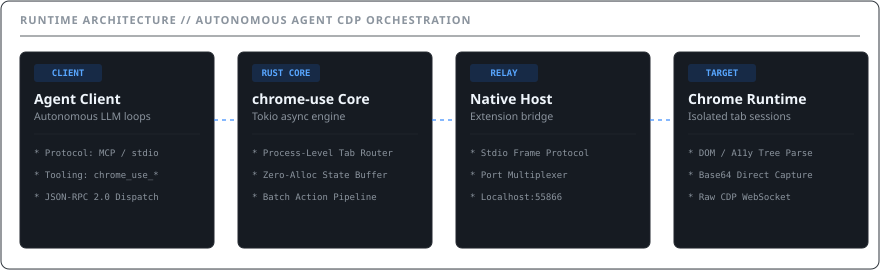

  <picture>
    <source media="(prefers-color-scheme: dark)" srcset="assets/header_dark.svg" />
    <source media="(prefers-color-scheme: light)" srcset="assets/header_light.svg" />
    
  </picture>

  <a href="https://ameerali.dpdns.org/">[ Portfolio ]</a> &nbsp;&bull;&nbsp;
  <a href="https://www.linkedin.com/in/ameeralianwar/">[ LinkedIn ]</a> &nbsp;&bull;&nbsp;
  <a href="https://github.com/AmeerAliAnwar?tab=repositories">[ Public Repositories ]</a> &nbsp;&bull;&nbsp;
  <a href="https://ameerali.dpdns.org/#contact">[ Direct Inquiries ]</a>

  <picture>
    <source media="(prefers-color-scheme: dark)" srcset="assets/telemetry_dark.svg" />
    <source media="(prefers-color-scheme: light)" srcset="assets/telemetry_light.svg" />
    
  </picture>

---

### Open Source Engineering

Systems contributions across browser automation runtimes, audio streaming engines, and platform tooling:

#### [leeguooooo/chrome-use](https://github.com/leeguooooo/chrome-use)
Browser automation CLI and Model Context Protocol (MCP) server built in Rust for autonomous AI agents.
* **CDP Event Flooding & Batch Execution ([PR #342](https://github.com/leeguooooo/chrome-use/pull/342))**: Eliminated redundant event dispatch bottlenecks, cut artificial sleeps, and added high-throughput batch execution for agent actions.
* **Tab Synchronization & Timer Settle ([PR #338](https://github.com/leeguooooo/chrome-use/pull/338))**: Deduplicated tab switch resync, implemented foreign tab adoption hints, and stabilized timers in tab duplication.
* **CI Hardening & MCP Tool Contract ([PR #331](https://github.com/leeguooooo/chrome-use/pull/331))**: Repaired CI workflows, resolved rustfmt lints, fixed borrow checker errors, and reinforced core MCP tool contracts.
* **Multi-Tab Concurrency Isolation ([PR #334](https://github.com/leeguooooo/chrome-use/pull/334))**: Engineered process-level tab isolation, tab switch aliases, and background compositor wake-up routines.
* **Base64 Screenshots & Paint Delay Elimination ([PR #329](https://github.com/leeguooooo/chrome-use/pull/329))**: Implemented direct base64 capture, eliminated background tab paint lag, and hardened multi-profile relay connections.
* **Trusted Coordinate Clicks & Dead Session Pruning ([PR #328](https://github.com/leeguooooo/chrome-use/pull/328))**: Enabled trusted coordinate dispatch on relay and pruned dead session targets on tab removal.
* **Concurrent Multi-Tab Workflows & Tab Targeting ([PR #330](https://github.com/leeguooooo/chrome-use/pull/330))**: Added multi-tab workflows, tab navigation flags, and granular session targeting.

#### [oscarbol09/audiobard](https://github.com/oscarbol09/audiobard)
AI-powered multi-voice audiobook generator with desktop GUI and CLI.
* **Linear O(N) Audio Concatenation ([PR #102](https://github.com/oscarbol09/audiobard/pull/102))**: Re-engineered clip concatenation from repeated re-allocations to a linear O(N) contiguous PCM buffer copy, eliminating memory spikes on large audiobooks.
* **Output Path Synchronization ([PR #104](https://github.com/oscarbol09/audiobard/pull/104))**: Respected user-configured output directories in desktop GUI and API routes.
* **Book Persistence & Conflict Resolution ([PR #103](https://github.com/oscarbol09/audiobard/pull/103))**: Persisted uploaded book structures to prevent regeneration HTTP 409 conflicts.

#### [googlecolab/google-colab-cli](https://github.com/googlecolab/google-colab-cli)
Command-line interface for Google Colab environments.
* **Native Windows Terminal Support ([PR #85](https://github.com/googlecolab/google-colab-cli/pull/85))**: Implemented platform-specific terminal control using `msvcrt` and `ctypes`, enabling native Windows support without requiring WSL or Docker containers.

---

### Verified Upstream PR Feed

<!-- PR_FEED_START -->
- [leeguooooo/chrome-use#467](https://github.com/leeguooooo/chrome-use/pull/467): fix(npm): drop defunct binary download and align install guidance
- [leeguooooo/chrome-use#465](https://github.com/leeguooooo/chrome-use/pull/465): fix(extension): remove unused approved sites allowlist card from options page
- [leeguooooo/chrome-use#464](https://github.com/leeguooooo/chrome-use/pull/464): fix(skills): remove unquoted colon in real-chrome frontmatter and add CI validator
- [leeguooooo/chrome-use#463](https://github.com/leeguooooo/chrome-use/pull/463): fix(daemon): clarify AGENT_BROWSER_STATE_EXPIRE_DAYS help text as opt-in (#426)
- [leeguooooo/chrome-use#462](https://github.com/leeguooooo/chrome-use/pull/462): docs(env): remove unused AGENT_BROWSER_HOME from command reference and docs (#427)
<!-- PR_FEED_END -->

---

### Selected Systems and Implementations

* **[FinVerz Core Banking Engine](https://ameerali.dpdns.org/)** (`C++`, `Hierarchical B+ Tree`, `Encrypted Ledger`)
  High-performance financial system featuring a custom Hierarchical Indexed Search Algorithm achieving 0.018ms median query latency across 100,000+ accounts.
  * [Read Benchmark Methodology and Verification Guide →](benchmarks/finverz_search_latency.md)

* **[Cloud Infrastructure Cost and Latency Optimization](https://ameerali.dpdns.org/)** (`Python`, `Docker`, `PostgreSQL`)
  Production infrastructure optimization framework cutting cloud deployment costs by 4x to 10x through query refactoring, connection pooling, and container downsizing.
  * [Read Cost Optimization Case Study and Methodology →](benchmarks/cloud_cost_optimization.md)

* **[chrome-use](https://github.com/AmeerAliAnwar/chrome-use)** (`Rust`, `CDP`, `WebSockets`)
  Headless and headed browser control daemon for AI agents with full Chrome DevTools Protocol support.

* **[audiobard](https://github.com/AmeerAliAnwar/audiobard)** (`Python`, `FastAPI`, `Desktop GUI`)
  Local audiobook generation suite supporting FOSS TTS backends and cloud voice synthesis.

* **[freellmapi](https://github.com/AmeerAliAnwar/freellmapi)** (`TypeScript`, `Node.js`, `HTTP Proxy`)
  High-throughput OpenAI-compatible proxy routing requests across free-tier provider pools.

* **[Promptimal](https://github.com/AmeerAliAnwar/Promptimal)** (`TypeScript`, `LLM APIs`)
  Programmatic prompt testing and optimization framework for large language models.

---

### Runtime Architecture

  <picture>
    <source media="(prefers-color-scheme: dark)" srcset="assets/architecture_dark.svg" />
    <source media="(prefers-color-scheme: light)" srcset="assets/architecture_light.svg" />
    
  </picture>

---

### Contribution Activity

  <picture>
    <source media="(prefers-color-scheme: dark)" srcset="assets/github-snake-dark.svg" />
    <source media="(prefers-color-scheme: light)" srcset="assets/github-snake.svg" />
    
  </picture>

---

### Technical Competencies

#### Core Production Stack
* **Languages**: C++, Python, Rust, TypeScript
* **Protocols and Runtimes**: Chrome DevTools Protocol (CDP), Model Context Protocol (MCP), Tokio Async Engine
* **Cloud and Infrastructure**: PostgreSQL, Docker, Linux / POSIX, Microservices, Git Workflows
* **AI Systems**: Autonomous Agent Runtimes, Multi-LLM Orchestration, Deterministic Fallbacks

#### Extended and Complementary
* **Languages and Scripting**: JavaScript, Dart, SQL, Shell / PowerShell
* **Datastores and Servers**: Redis, FastAPI, Node.js, Nginx
* **Media and Client Frameworks**: WebSockets, FFmpeg Rubberband Audio, PyTorch, React, Flutter

---

### Profiles and Contact

* **Interactive Portfolio**: [ameerali.dpdns.org](https://ameerali.dpdns.org/)
* **LinkedIn**: [linkedin.com/in/ameeralianwar](https://www.linkedin.com/in/ameeralianwar/)
* **GitHub**: [@AmeerAliAnwar](https://github.com/AmeerAliAnwar)
* **Direct Inquiries**: [ameerali.dpdns.org/#contact](https://ameerali.dpdns.org/#contact)
