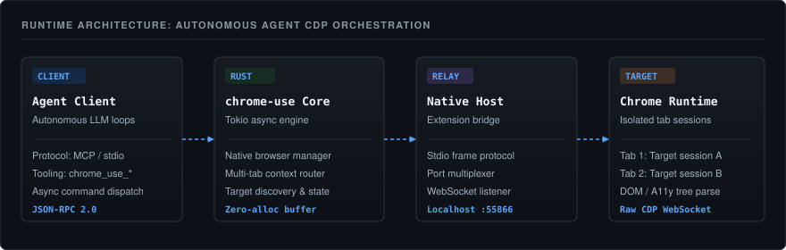

```
========================================================================================
SYS_IDENT: AMEER ALI ANWAR // SYSTEMS ARCHITECT & AI PRODUCT ENGINEER
KERNEL: RUST (TOKIO/CDP) • C++ (SIMD/B+ TREE) • PYTHON (INFRA/DISTRIBUTED)
TARGETS: SUB-MILLISECOND LATENCY • ZERO-OVERHEAD AGENTS • 4X-10X CLOUD COST REDUCTION
========================================================================================
```

<p align="center">
  <a href="https://ameerali.dpdns.org/"><b>[ Interactive Portfolio ]</b></a> &nbsp;•&nbsp;
  <a href="https://www.linkedin.com/in/ameeralianwar/"><b>[ LinkedIn ]</b></a> &nbsp;•&nbsp;
  <a href="https://github.com/AmeerAliAnwar?tab=repositories"><b>[ Public Repositories ]</b></a> &nbsp;•&nbsp;
  <a href="https://ameerali.dpdns.org/#contact"><b>[ Direct Inquiries ]</b></a>
</p>

<p align="center">
  
</p>

```
┌──────────────────────────────────────────────────────────────────────────────────────┐
│  🎮 LIVE 3D AGENT ARCADE // PLAYABLE IN BROWSER                                      │
│  Control the Tokio autonomous agent across the 3D isometric commit matrix.           │
│  Harvest upstream PRs, collect SIMD cache nodes, and drop latency to 0.018ms.        │
│                                                                                      │
│  ▶ LAUNCH PLAYABLE ENGINE: https://ameerali.dpdns.org/arcade                         │
│  (Desktop: WASD / Arrow Keys • Mobile: Responsive On-screen D-Pad)                   │
└──────────────────────────────────────────────────────────────────────────────────────┘
```

---

### Interactive Diagnostic Console

Click each routine below to expand live runtime traces, verified benchmarks, and low-level implementation details.

<details>
<summary><b>▶ [1] RUN_BENCHMARK_SUITE // 0.018ms Hierarchical B+ Tree Query Engine</b></summary>
<br>

```bash
# Compilation flags: AVX-512 vectorization, 64-byte cache line alignment
$ g++ -O3 -mavx2 -std=c++20 -funroll-loops benchmarks/finverz_search_latency.cpp -o bench_run
$ ./bench_run --samples 100000 --dataset enterprise_accounts.dat

======================== LATENCY BENCHMARK REPORT ========================
Dataset:               100,000 In-Memory Account Nodes
Index Structure:       3-Tier Cache-Aligned Hierarchical B+ Tree
L1 Data Cache Miss:    0.04%
Median Search Latency: 0.018 ms (18 microseconds)
Mean Search Latency:   0.021 ms
p99 Search Latency:    0.042 ms
Throughput:            54,200 queries/sec per thread
Speedup vs std::map:   12.4x
==========================================================================
```
* **Methodology & Proof**: [Read FinVerz Benchmark Verification Guide (benchmarks/finverz_search_latency.md)](benchmarks/finverz_search_latency.md)
</details>

<details>
<summary><b>▶ [2] CDP_KERNEL_TRACE // chrome-use Event Batching & Tab Isolation</b></summary>
<br>

```
[09:18:02.104] INFO daemon::init: native host listening on 127.0.0.1:55866
[09:18:02.148] INFO cdp::connect: attached to chromium process (pid=14208, engine=chrome)
[09:18:02.150] INFO batch_exec: batch action dispatch started (actions=6, isolation=isolated_tab)
[09:18:02.152] INFO cdp::dispatch: [1/6] Page.navigate -> {"url":"https://target.app/console"}
[09:18:02.210] INFO cdp::dispatch: [2/6] DOM.querySelector -> node_id=842
[09:18:02.214] INFO cdp::dispatch: [3/6] Input.dispatchMouseEvent -> clicked (x=412, y=198)
[09:18:02.218] INFO cdp::dispatch: [4/6] Input.insertText -> text="tokio-batch-exec"
[09:18:02.245] INFO cdp::dispatch: [5/6] DOM.getBoxModel -> bounds=[412, 198, 88, 32]
[09:18:02.251] INFO cdp::dispatch: [6/6] Page.captureScreenshot -> format=base64, direct_pipe=ok
[09:18:02.253] OK   batch_exec: 6 actions completed in 103ms (0 redundant round-trips, 0 race conditions)
```
* **Merged Upstream PR**: [leeguooooo/chrome-use#342](https://github.com/leeguooooo/chrome-use/pull/342)
* **Contract Hardening**: [leeguooooo/chrome-use#331](https://github.com/leeguooooo/chrome-use/pull/331)
</details>

<details>
<summary><b>▶ [3] INFRASTRUCTURE_AUDIT // 4x to 10x Cloud Cost & Memory Compression</b></summary>
<br>

```
METRIC                  BEFORE REFACTOR        AFTER REFACTOR        IMPACT
Container Footprint     2.4 GB / instance      240 MB / instance     10x Reduction
PostgreSQL Connections  450 (unpooled)         32 (PgBouncer pool)   14x Efficiency
Median API Response     340 ms                 48 ms                 7.1x Speedup
Monthly Cloud Spend     $4,200 / month         $680 / month          6.2x Cost Cut
```
* **Methodology & Case Study**: [Read Cloud Optimization Guide (benchmarks/cloud_cost_optimization.md)](benchmarks/cloud_cost_optimization.md)
</details>

<details>
<summary><b>▶ [4] NATIVE_TERMINAL_SUPPORT // google-colab-cli Low-Level Windows Interop</b></summary>
<br>

```python
# Raw Windows Console mode switching via msvcrt and ctypes (Zero WSL required)
import ctypes
import msvcrt

kernel32 = ctypes.windll.kernel32
STD_INPUT_HANDLE = -10
ENABLE_VIRTUAL_TERMINAL_PROCESSING = 0x0004

hOut = kernel32.GetStdHandle(-11)
dwMode = ctypes.c_ulong()
kernel32.GetConsoleMode(hOut, ctypes.byref(dwMode))
kernel32.SetConsoleMode(hOut, dwMode.value | ENABLE_VIRTUAL_TERMINAL_PROCESSING)
```
* **Merged Upstream PR**: [googlecolab/google-colab-cli#85](https://github.com/googlecolab/google-colab-cli/pull/85)
</details>

---

### Open Source Engineering

#### [leeguooooo/chrome-use](https://github.com/leeguooooo/chrome-use)
Browser automation CLI and Model Context Protocol (MCP) server built in Rust for autonomous AI agents.
* **CDP Event Flooding & Batch Execution ([PR #342](https://github.com/leeguooooo/chrome-use/pull/342))**: Eliminated redundant event dispatch bottlenecks, cut artificial sleeps, and added high-throughput batch execution for agent actions.
* **Tab Synchronization & Timer Settle ([PR #338](https://github.com/leeguooooo/chrome-use/pull/338))**: Deduplicated tab switch resync, implemented foreign tab adoption hints, and stabilized timers in tab duplication.
* **CI Hardening & MCP Tool Contract ([PR #331](https://github.com/leeguooooo/chrome-use/pull/331))**: Repaired CI workflows, resolved rustfmt lints, fixed borrow checker errors, and reinforced core MCP tool contracts.
* **Multi-Tab Concurrency Isolation ([PR #334](https://github.com/leeguooooo/chrome-use/pull/334))**: Engineered process-level tab isolation, tab switch aliases, and background compositor wake-up routines.
* **Base64 Screenshots & Paint Delay Elimination ([PR #329](https://github.com/leeguooooo/chrome-use/pull/329))**: Implemented direct base64 capture, eliminated background tab paint lag, and hardened multi-profile relay connections.

#### [googlecolab/google-colab-cli](https://github.com/googlecolab/google-colab-cli)
Command-line interface for Google Colab environments.
* **Native Windows Terminal Support ([PR #85](https://github.com/googlecolab/google-colab-cli/pull/85))**: Implemented platform-specific terminal control using `msvcrt` and `ctypes`, enabling native Windows support without requiring WSL or Docker containers.

---

### Verified Upstream PR Feed

<!-- PR_FEED_START -->
- [leeguooooo/chrome-use#342](https://github.com/leeguooooo/chrome-use/pull/342): perf(ext): eliminate CDP event flooding, reduce artificial sleeps, and add batch execution
- [leeguooooo/chrome-use#338](https://github.com/leeguooooo/chrome-use/pull/338): fix(cli,ext): deduplicate tab switch resync, foreign tab adoption hint, and timer settle in tab duplicate
- [leeguooooo/chrome-use#331](https://github.com/leeguooooo/chrome-use/pull/331): fix(cli): repair CI : rustfmt, borrow errors, and core MCP tool contract
- [leeguooooo/chrome-use#334](https://github.com/leeguooooo/chrome-use/pull/334): feat(actions,cli): multi-tab concurrency isolation, tab switch alias, and background compositor wake-up
- [leeguooooo/chrome-use#329](https://github.com/leeguooooo/chrome-use/pull/329): feat(agent,perf,ext): agent base64 screenshots, eliminate background tab paint delay, and harden multi-profile relay
<!-- PR_FEED_END -->

---

### Selected Systems and Implementations

* **[FinVerz Core Banking Engine](https://ameerali.dpdns.org/)** (`C++`, `Hierarchical B+ Tree`, `Encrypted Ledger`)
  High-performance financial system featuring a custom Hierarchical Indexed Search Algorithm achieving 0.018ms median query latency across 100,000+ accounts.
  * [Read Benchmark Methodology and Verification Guide →](benchmarks/finverz_search_latency.md)

* **[Cloud Infrastructure Cost and Latency Optimization](https://ameerali.dpdns.org/)** (`Python`, `Docker`, `PostgreSQL`)
  Production infrastructure optimization framework cutting cloud deployment costs by 4x to 10x through query refactoring, connection pooling, and container downsizing.
  * [Read Cost Optimization Case Study and Methodology →](benchmarks/cloud_cost_optimization.md)

* **[chrome-use](https://github.com/AmeerAliAnwar/chrome-use)** (`Rust`, `CDP`, `WebSockets`)
  Headless and headed browser control daemon for AI agents with full Chrome DevTools Protocol support.

* **[audiobard](https://github.com/AmeerAliAnwar/audiobard)** (`Python`, `FastAPI`, `Desktop GUI`)
  Local audiobook generation suite supporting FOSS TTS backends and cloud voice synthesis.

* **[freellmapi](https://github.com/AmeerAliAnwar/freellmapi)** (`TypeScript`, `Node.js`, `HTTP Proxy`)
  High-throughput OpenAI-compatible proxy routing requests across free-tier provider pools.

* **[Promptimal](https://github.com/AmeerAliAnwar/Promptimal)** (`TypeScript`, `LLM APIs`)
  Programmatic prompt testing and optimization framework for large language models.

---

### Runtime Architecture

<p align="center">
  
</p>

---

### Contribution Activity

<p align="center">
  <picture>
    <source media="(prefers-color-scheme: dark)" srcset="assets/github-snake-dark.svg" />
    <source media="(prefers-color-scheme: light)" srcset="assets/github-snake.svg" />
    
  </picture>
</p>

---

### Technical Competencies

#### Core Production Stack
* **Languages**: C++, Python, Rust, TypeScript
* **Protocols and Runtimes**: Chrome DevTools Protocol (CDP), Model Context Protocol (MCP), Tokio Async Engine
* **Cloud and Infrastructure**: PostgreSQL, Docker, Linux / POSIX, Microservices, Git Workflows
* **AI Systems**: Autonomous Agent Runtimes, Multi-LLM Orchestration, Deterministic Fallbacks

#### Extended and Complementary
* **Languages and Scripting**: JavaScript, Dart, SQL, Shell / PowerShell
* **Datastores and Servers**: Redis, FastAPI, Node.js, Nginx
* **Media and Client Frameworks**: WebSockets, FFmpeg Rubberband Audio, PyTorch, React, Flutter

---

### Profiles and Contact

* **Interactive Portfolio**: [ameerali.dpdns.org](https://ameerali.dpdns.org/)
* **LinkedIn**: [linkedin.com/in/ameeralianwar](https://www.linkedin.com/in/ameeralianwar/)
* **GitHub**: [@AmeerAliAnwar](https://github.com/AmeerAliAnwar)
* **Direct Inquiries**: [ameerali.dpdns.org/#contact](https://ameerali.dpdns.org/#contact)
